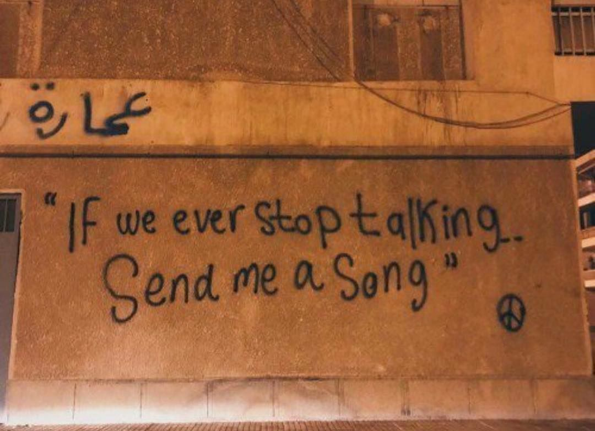

Someone shared this photo recently as a status update and it had me intrigued.
I didn’t want to repost it because I thought it had an air of _uncoolness_ but the statement is grounded in truth. 

We all have a unique relationship with music. 
We scour different sources to discover new music. 
Some of us go deep, digging through obscure corners of the internet for new gems. 
Others stick to radio hits or build a collection of vinyls and high-end setups. 

Whatever the approach, music can be more than just a personal escape. 
It can bridge the gap in our relationships. 

We lose touch with old friends as life changes. 
Sometimes I want to reconnect with some but never quite know where to start.
There's always the fear that a simple "hey" might open doors I'm not ready to walk through -- there's always too many questions and much more explaining.

But maybe music can be that spark. 

So, if you're reading this and feel like reconnecting, you can send me a song, however you want. 
It could be a tune that reminds you of yours truly, one I sang (or butchered), a new favourite, or one to express the pain I caused you or any other passionate feeling.

And hey, it doesn't have to be me.
If someone else comes to your mind, reach out to them. 
I'm sure, just like me, they'd love to hear what's playing on your end. 
