Besides Mariah Carey having fully thawed, it's that time when we all realise how much we repeat the same tunes over and over while pretending we've discovered something new.
Just kidding.
Additionally, for the second year running, I'm prioritising posting my music recap on here. 

Overall, when it comes to the big number everyone likes to share, I had 57,645 total listening minutes – pretty much in line with every year from 2023. 

So.... let's get down to it. 

The elephant in the room is I actually stuck with Apple Music after [switching to it]() back in February, so this year's recap is a little fragmented. 
I'll probably post about my time away from Spotify at some point, but I'm enjoying my time off. 

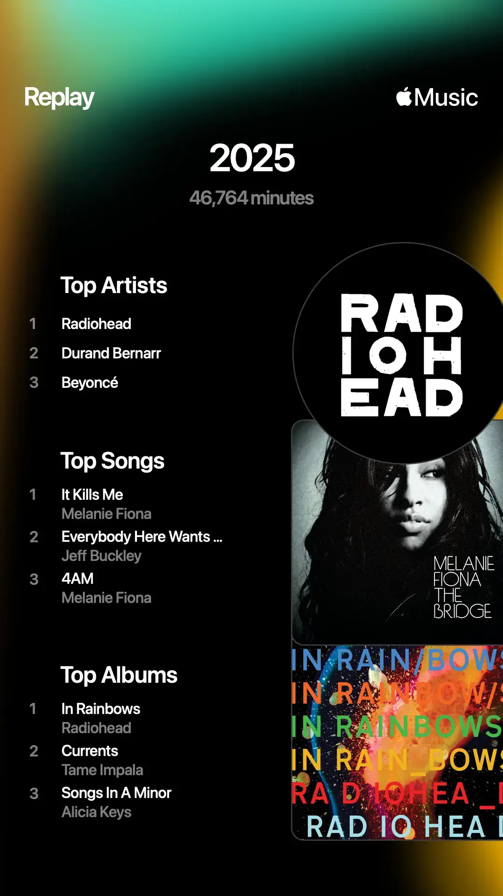
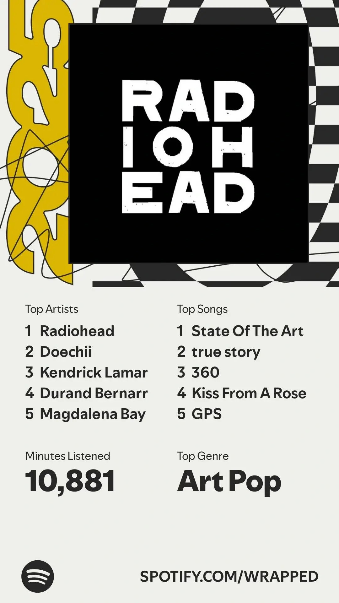

Anyway, if we take a short view back to the recent past, I dove into Radiohead's discography last year and "saying I love them is a massive understatement". 
I was shocked/disappointed that they didn't make any of my 2024 list but my god are they all over it this year. 
Oh, they showed up.

I listened to Radiohead for a whopping 1,731 minutes, with _In Rainbows_ leading my Top Albums list. 
_The Bends_ came in third, and _OK Computer_ rounded it out in ninth. 
I never used to understand why certain songs of theirs held onto me, but the last year and a bit has made it very clear: give me anything melancholic, floaty, or drenched in bewitching vocals, and I'm gone. 

Durand Bernarr was my second-most-listened artist, and once again, I'm not shocked.
He released _BLOOM_ which took over my May, but he's always been someone I revisit a lot. 
His [Tiny Desk Concert](https://youtu.be/klL7nY1HzaY) is one of my all-time favourites, along with his many appearances on [The TERRELL Show](https://www.youtube.com/@terrellgrice). 
Now that I've mentioned Terrell: y'all need to seriously listen to _The Terrell One Million Show_ or [watch it](https://youtu.be/s4Y0N8qp4ZM).
It's rather amazing. 
There are so many great covers and mashups on there. 
_My Testimony / Let Go_ by Kelontae Gavin and _Masterpiece (Mona Lisa)_ by Riley are my favourites.
The latter was on repeat so much that my parent now randomly sings it whenever someone mentions the name "Mona Lisa".

Back to the recap: I'll be honest, _Somebody That I Used To Know_ was the only Gotye song I knew since it went viral, until late last year when I discovered _State of the Art_ in some reaction video and immediately loved it. 
That one and _Hearts a Mess_ are my favourites, but do yourself a favour and listen to his entire album, _Making Mirrors_.

Melanie Fiona also had her moment in my year.
Her [appearance on the blue wall](https://youtu.be/mzG_v2TGddE) reminded me how incredible she is, and I ended up looping _It Kills Me_ and _4AM_ in March and April... and apparently the entire year. 
She really had a grasp on the 2000s music scene, and it's such a shame she never got the recognition she deserved. 

To wrap things up: Tame Impala finally released something new, but I'm still stuck on _Currents_.
I'll definitely listen to it soon. 
A [Jeff Buckley documentary](https://www.imdb.com/title/tt34966650/) also dropped, which I haven't watched yet – but I enjoyed revisiting his 1994 album _Grace_.
If you've listened or watched either, let me know how they are. 

I also enjoyed the latest rap entry by Joey Valence & Brae, _HYPERYOUTH_ in November.
Tyler, The Creator fans will definitely enjoy this too.
The features are great and their interview on [turning the tables Podcast](https://youtu.be/UUJQR3Q86TY) is a fun watch too. 

Finally, I surprisingly liked Spotify Wrapped this year, even though mine was based on only a few months of usage.
I guess they took the flack they got last year to heart – though with this year's controversial headline about the platform and Daniel Ek, maybe not.

Anyway, here are all the screenshots for you to scour through if you're inclined. 
I didn't break down everything in them, but there are definitely some gems. 

So here's my little call to action, [send me a song]() recommendation from your recap, why you like it, and maybe a thought about mine (a song/artist you also love, a question, anything).
If you want, you can send your recap screenshot too. 
My email inbox is open. 

For now – till next year.

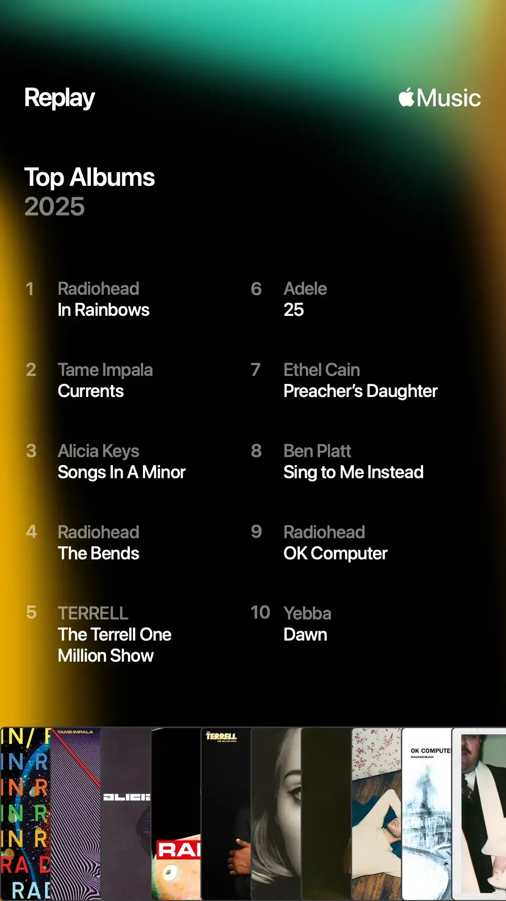
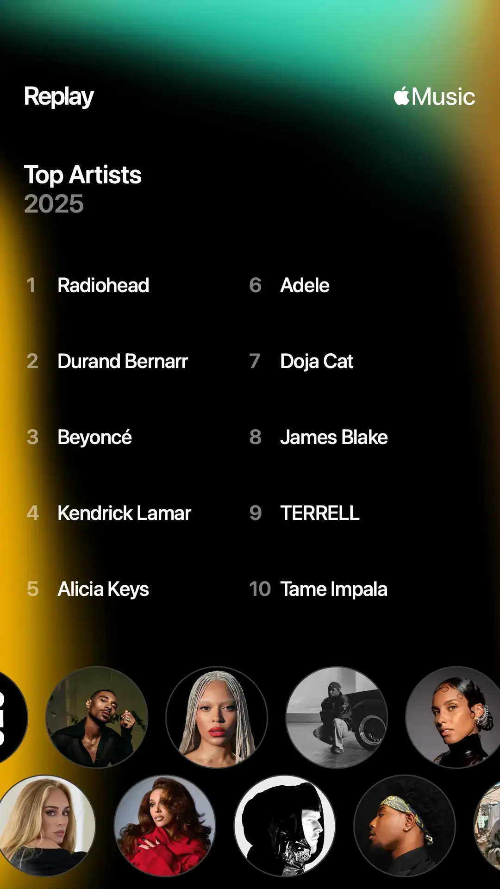
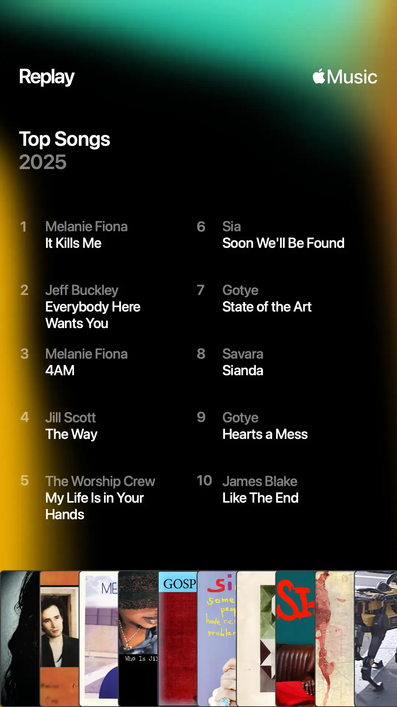
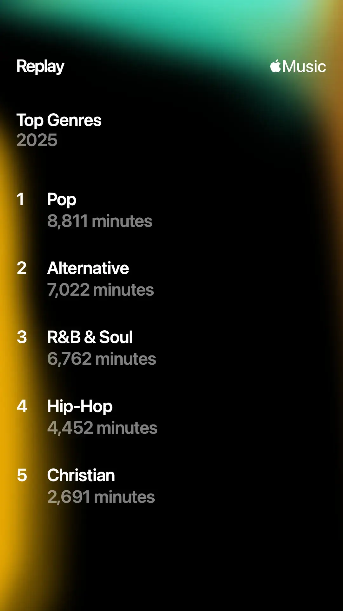

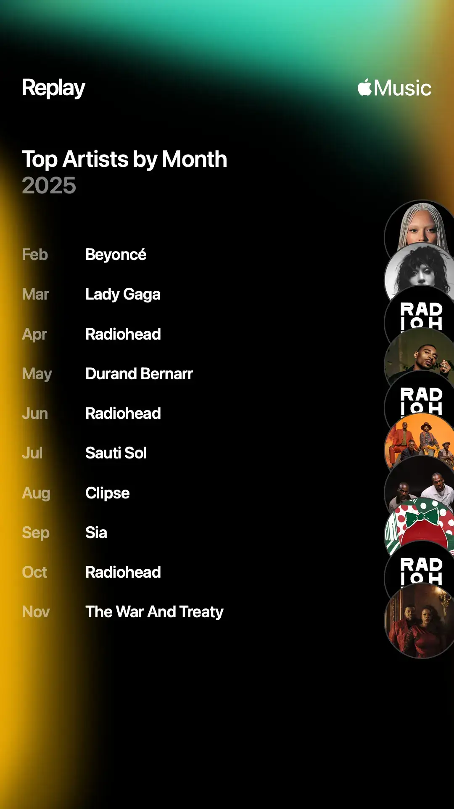
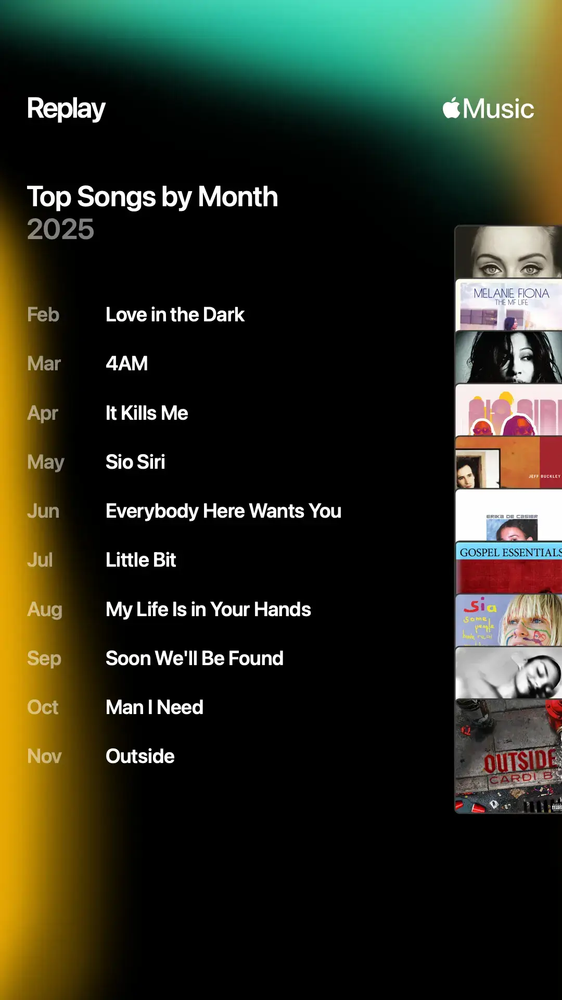
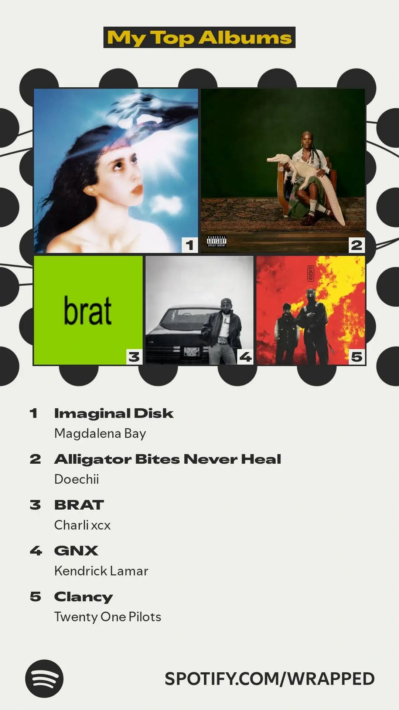
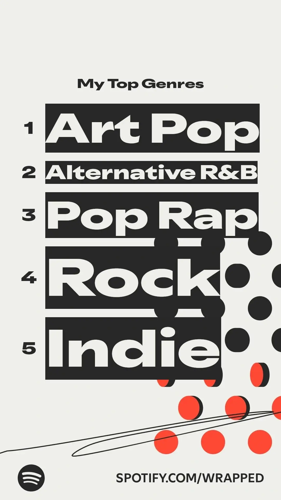
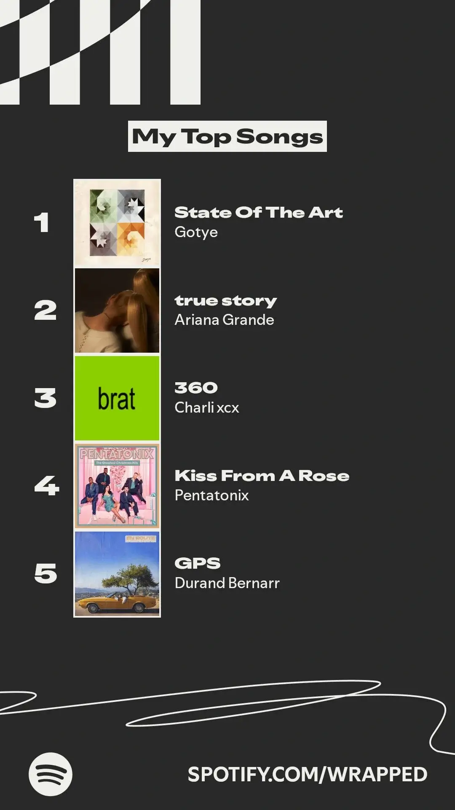
