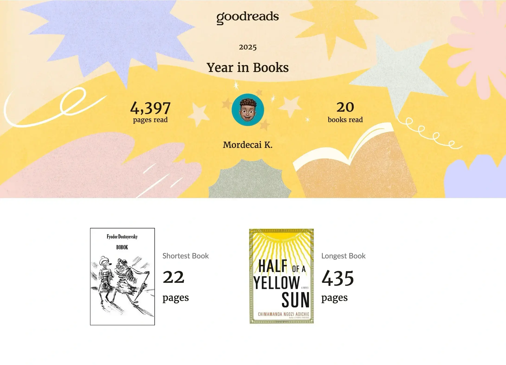
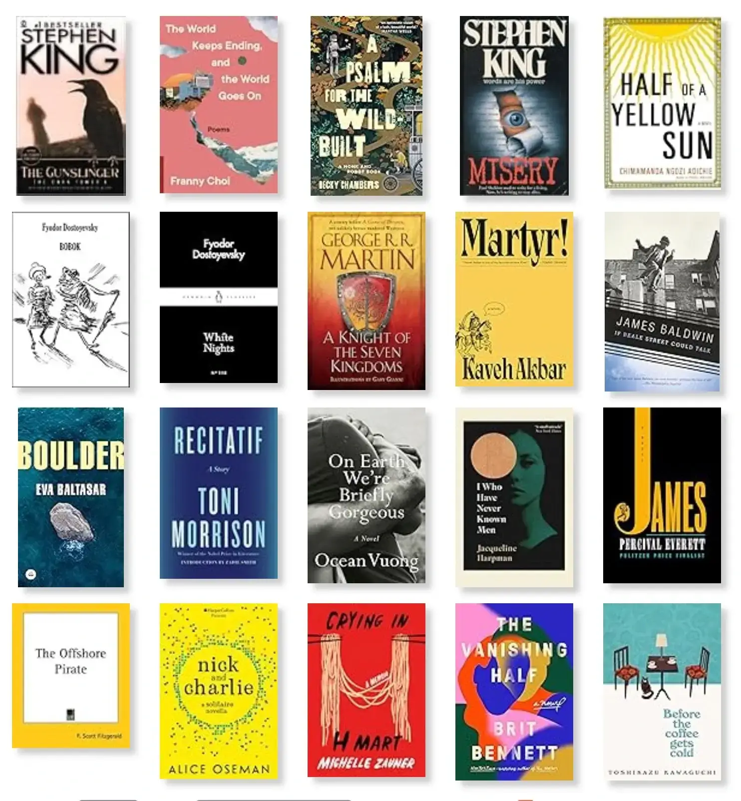
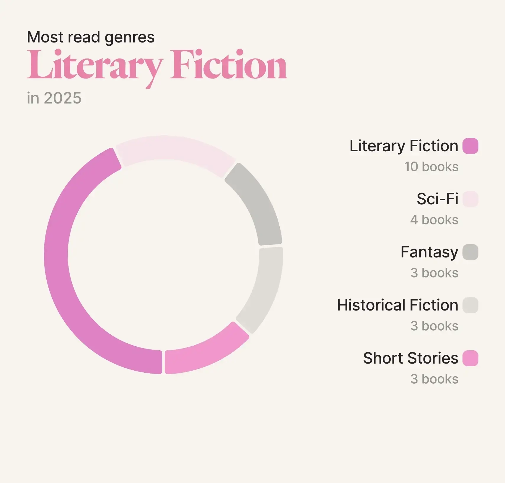
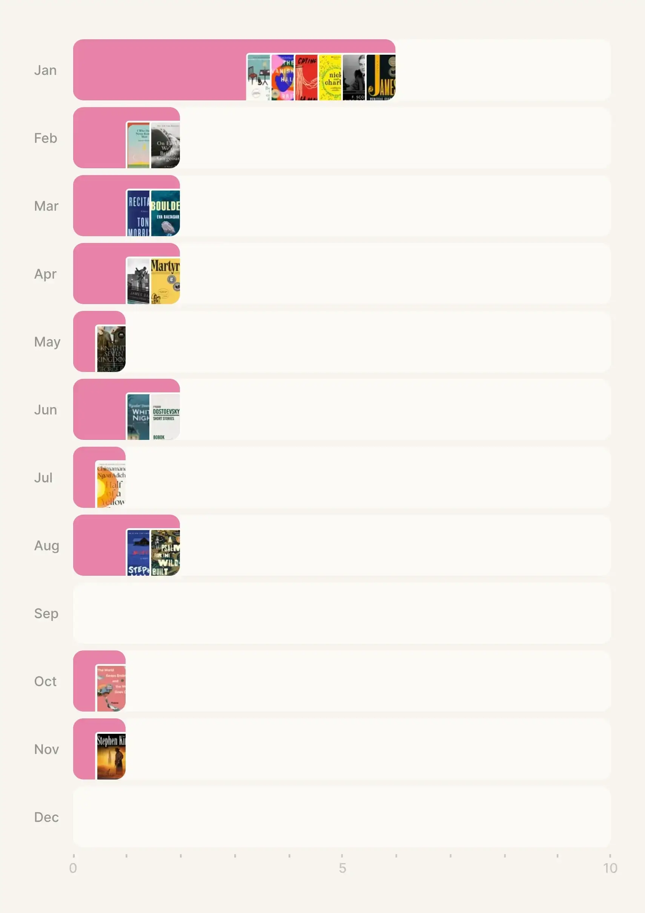

Like every previous year, Goodreads prompted me to set how many books I wanted to read as the year began. 
[I had read 28 books in 2024]() and you'd think this would have been the bare minimum for 2025, but no, I went a different route. 
20 books seemed like a more reasonable target, with a twist: reading thiccc books.

So... I typed out my reading goals in my notes app: 
- [x] Read 20 books
- [ ] Read at least one chunky book (~500 pages or more) 
- [ ] Read more African literature 
	- [ ] at least one Kenyan author 
	- [x] at least one Chimamanda Ngozi Adichie book 
- [ ] Start on the GOT/ASOIAF series, continue the Red Rising series
- [x] Read at least one (auto)biography or memoir

So, how did this all pan out? 
I achieved my target, but not in terms of book size.
The upside is that my average page count was 219 pages, up from 192 pages in 2024.
Regarding _A Song of Ice and Fire_ (the book series that _Game of Thrones_ is based on), I never got to turn those pages but my priority was on the Dunk & Egg novellas due to the upcoming HBO series. 
I read _A Knight of the Seven Kingdoms_ and loved it. 
George R.R. Martin has a way with words and world-building that has you deeply fixated on the book.
I didn't resume the Red Rising series and I really wish I had, though.
Perhaps I wouldn't have had a major reading slump.
That said, it wasn't a total loss. 

With that out of the way, here are all the books I read in 2025 and some details of my favourite picks.

Out of everything I read, a few stood out from the rest.
My top recommendations in no particular order have to be: 
1. _James_ by Percival Everett
2. _I Who Have Never Known Men_ by Jacqueline Harpman
3. _Martyr!_ by Kaveh Akbar
4. _Half of a Yellow Sun_ by Chimamanda Ngozi Adichie 
5. _Misery_ by Stephen King

_James_ is the first book (303 pages) I can remember ever reading in 24 hours. 
It's a reimagining of _Adventures of Huckleberry Finn_ told from Jim's point of view. 
He goes on a dangerous journey as a runaway slave until he can figure out how to rescue his family.
Percival Everett manages to weave in a bit of humour but even then, I can't provide a description that will do this book justice. 
Just simply read it. 
If I was forced to pick my favourite book of the year, then this would be it. 

While _James_ was gripping in its momentum, the next book stayed with me for entirely different reasons.
_I Who Have Never Known Men_ is the only non-5 star read on this list but it started life as a 3 star read before its upgrade to 4 stars.
Simply because, the story stuck with me. 
It felt like a new take on an old tired idea of being the last man standing on earth. 
We follow the young main character alongside 39 other women in a dystopian and desolate world as the last people alive. 
Along the way, we get glimpses of hope but it's quickly dashed every single time right till the final traumatising sentence. 
I have a positive spin on the outcome but I fear spoiling the book, so... there's a reply link at the bottom.

Still thinking about meaning and survival, we move on to my next pick – _Martyr!_.
Kaveh Akbar shifts between different points of view with lyrical writing and a unique structure to cover martyrdom. 
The main character is an Iranian boy living in America exploring the idea of making your death matter. 
Alongside this, the author covers themes of sobriety, grief, and identity with a sprinkle of humour to lighten the subject.
Again, if I had a gun to my head, then I'd pick this as my second favourite book of the year.

One of my goals this year was to read more African literature, which is how I ended up with _Half of a Yellow Sun_. 
I'm always left in awe after watching a Chimamanda interview.
I get the need to protest or take an action. 
I'd joke with myself that when I grow up, I want to be as eloquent as her.
However, it felt sacrilegious to have never read a book from her so I started off with this.
It's a popular book and many Kenyans have at least heard of the title.
I was not surprised by the writing and the detail in the book. 
What I wasn’t prepared for, though, were the events themselves.
I was shocked by the accounts of the characters. 
The book is largely based on the Nigeria-Biafra war so this was a learning moment for me. 
It showcases how tribalism can lead to widespread bloodshed and degradation of humanity. 
Reading this in the present day made it feel uncomfortably relevant.
We aren't taught about this war in school but it totally should especially with some local leaders spewing tribal rhetoric at the time of reading.
This book is a stark reminder that such division remains close to the surface, bubbling slowly as it waits for a moment of eruption.
It's very reminiscent of other tragedies across Africa with many rooted in, perhaps unsurprisingly, colonial era divide-and-conquer tactics.

After all that emotional weight, my next pick is something completely different, a little more unsettling – _Misery_.
This was my first foray into Stephen King's massive catalogue and I was not disappointed.
I mean what a writer!
The book is basically a chilling tale on how obsession can turn hellish and how far a "fan" can go.
It's beautifully descriptive yet bleak in the best way and soul-crushing, especially because the horror feels so real and within the realms of possibility. 
This is such a gut-wrenching, gripping and unforgettable story.

So yeah, that was my reading year and those are my picks.

Which one do you like the sound of? 
How many books did you read? 
What was your best read of the year? 
Any other recommendations? 
I'd love to hear from you all. 

