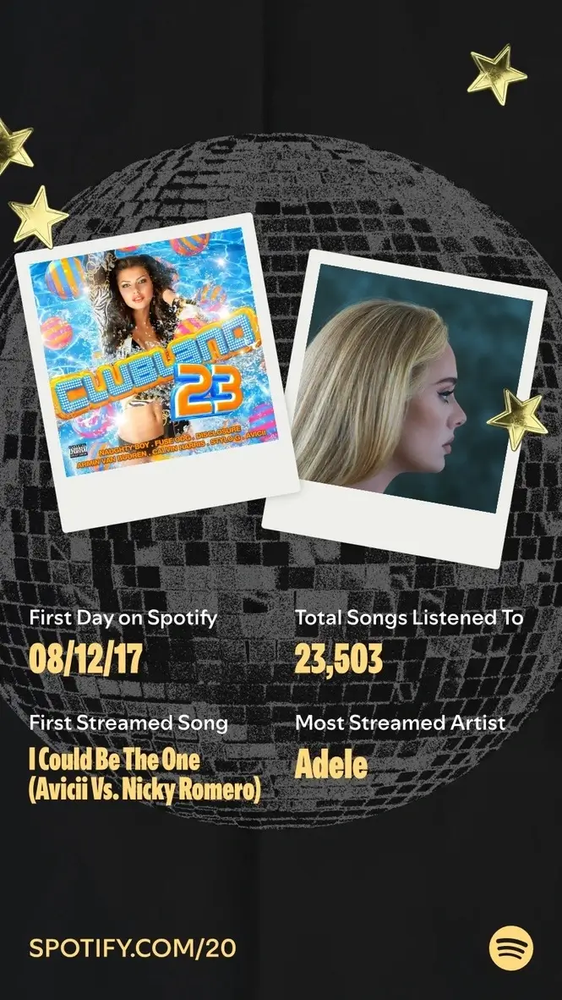

As many frequent readers of this site might know, I [jumped ship to Apple Music from Spotify]().
Even so, I often keep up with changes to the app and even fire it up from time to time. 

A few weeks back, I noticed Spotify was celebrating its [20th anniversary](https://newsroom.spotify.com/2026-05-12/spotify-20-personal-music-retrospective/) with a version of Wrapped available. 
That piqued my curiosity enough that I wanted to write about my data but never got around to it. 
I simply downloaded the infographic and let it collect dust in my gallery... until today. 

Consider this a dump of said graphic with a little extra context. 

For those who've come to know me, it's no surprise that Adele is my most-streamed artist. 
_[25](https://en.wikipedia.org/wiki/25_(Adele_album))_ is the first album I ever listened to in its entirety in one sitting. 
Before that, I was a playlist kind of guy, listening mostly to singles, hits and recommendations. 
Beyond that, her music holds a dear place in my heart, so this data point wasn't new to me. 

What surprised me was my first day using the service. 
For the life of me, I always thought it was around 2015 based on the early connections I made, but December 2017 makes more sense, coming just after I finished high school. 

With no context from other people's data, the number of songs I've listened to seems average to me.
The only explanation I have is that the app wasn't my primary way of listening to music until February 2021. 
That was when Spotify officially entered the Kenyan market, along with several other African countries. 
Fiddling with VPNs before that was fine, but too much of a hassle, so pirating was still the better option. 

When it come to my first song, I have periods in my life when I jump back into Avicii's discography—today is one of them. 
The music video for [_I Could Be The One_](https://youtu.be/6Lh7Zg8WXwU) is crazy and fun, and I think that's all I can say. 

And that's it.
